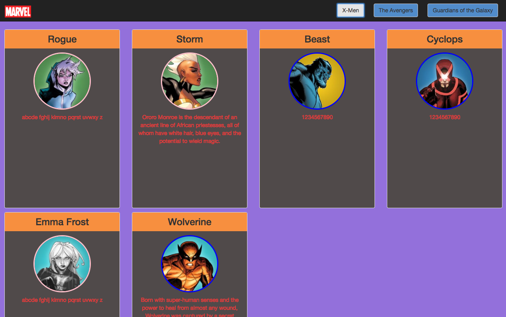

# Marcus' Comic Book Challenge

#### TECHNOLOGIES USED:
- HTML
- CSS
- JavaScript - ES6
- JQuery
- BOOTSTRAP
- JSON

## Assignment Parameters:
* RUN GRUNT ON PROJECT
* USE ES6 SYNTAX (Fat Arrows, let, const)
* AJAX PROMISE STRUCTURE FOR ALL CALLS

#### On Page load:
* STYLING MUST USE BOOTSTRAP
* There should be a large Marvel logo

#### Screenshot of Page Load:


#### On click of a button in the navbar:
* The large Marvel logo should go away (use a jQuery method for this)
* The click event should call a function called dataGetter that has a Promise.all
* The Promise.all should resolve 3 functions that get the data from the json files
* dataGetter should pass a SINGLE array to the writeDom function
* The writeDom function should write everything to the DOM

#### Data requirements:
* If there is no description for a character (ie description is "") your code should change the description as follows:
  * A female character with no description should get a description of "abcde fghij klmno pqrst uvwxy z"
  * A male character with no description should get a description of "1234567890"

#### Style requirements:
* Each character should be displayed in a bootstrap panel
* Each character's image should be a circle and have a border color of:
  * Blue if the character is Male
  * Pink if the character is Female
* There should be 4 panels in each row
* Each row should have a bootstrap row class


#### On button click:


#### HOW TO RUN:
```
1. git clone https://github.com/nss-evening-cohort-05/modernjs-mastery-exercise-jmarcugill
2. modernjs-mastery-exercise-jmarcusgill
3. npm install http-server -g
4. http-server -p 8080

cd into lib directory
bower init
bower install jquery --save
bower install bootstrap --save
npm init
npm install

```

#### Contributor:
[James Marcus Gill](https://github.com/jmarcusgill)